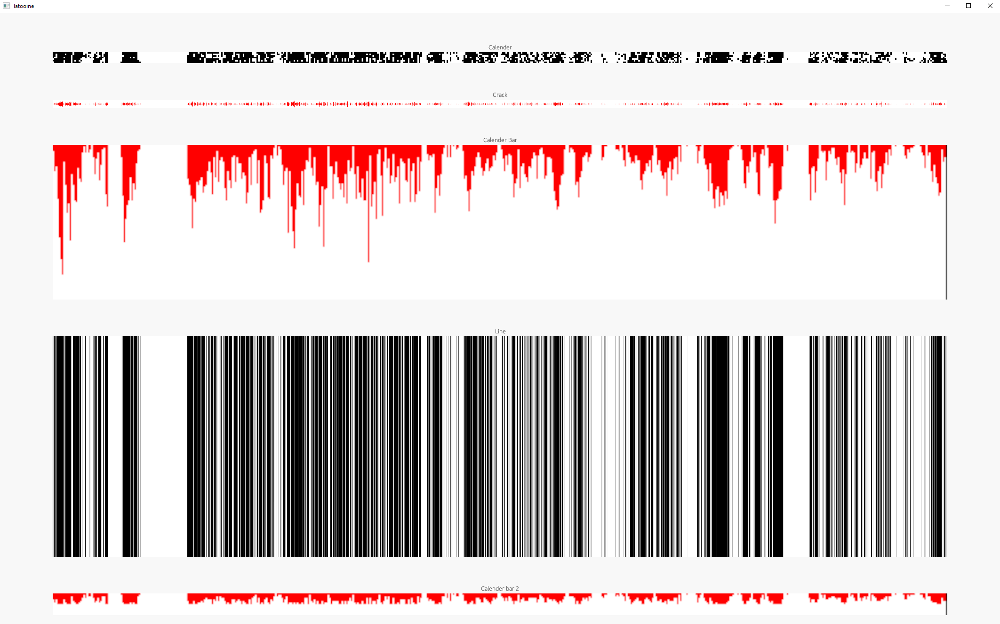
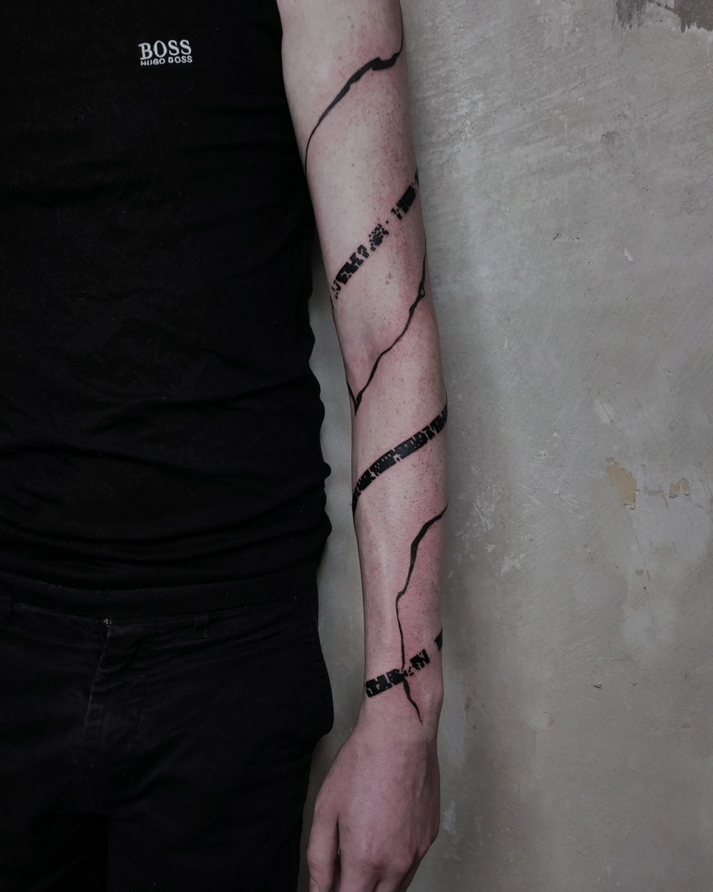

# Dota 2 Match History Activity Diagram

This project is a small Rust application designed to create an activity diagram of my Dota 2 match history. The focus of the user interface is on functionality, providing a clear and comprehensive overview of the match activities.

## Usage Guide

To configure the application, rename .env.example to .env and update the file with your specific environment variables.

## Application Screenshot

Below is a screenshot of the application in use, showing the generated activity diagram for a series of Dota 2 matches:

## Tattoo Inspired by the Project

Inspired by the data visualization offered by this project, I decided to get a tattoo representing a significant aspect of my Dota 2 match history. The tattoo was skillfully done by a talented artist whose work can be found on Instagram.

### Tattoo Artist

The tattoo was created by [iza.blk](https://www.instagram.com/iza.blk/), a highly skilled tattoo artist. You can view more of their work on their Instagram profile.

### Tattoo Result

Here is the final result of the tattoo, capturing the essence of my Dota 2 match history activity diagram:

